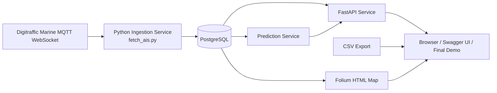

# Data Architecture Diagram

## Table version

| Component | Role |
|---|---|
| Digitraffic Marine MQTT | Source of live AIS messages |
| Ingestion service | Collects and parses AIS data |
| PostgreSQL | Stores history and latest vessel state |
| Prediction service | Estimates short-term future position |
| FastAPI | Makes data queryable and downloadable |
| Folium map | Creates sea map visualization |
| Browser/Swagger UI | Final user-facing demonstration |
